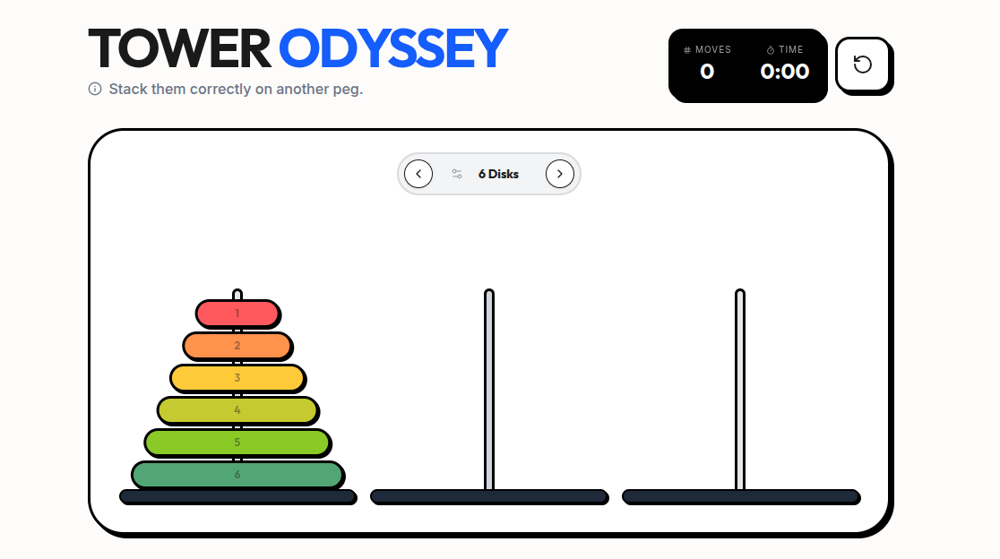

<div align="center">

</div>

# Tower Odyssey

A modern, interactive implementation of the classic Tower of Hanoi puzzle built with React, TypeScript, and Vite. Experience the mathematical challenge with smooth animations, customizable difficulty, and real-time move tracking.

## Features

- **Interactive Gameplay**: Drag and drop disks between towers
- **Visual Feedback**: Smooth animations and color-coded disks
- **Difficulty Levels**: Choose from 3 to 8 disks
- **Move Counter**: Track your progress with real-time move counting
- **Timer**: Challenge yourself with time-based scoring
- **Responsive Design**: Play on desktop and mobile devices
- **Minimalist UI**: Clean, modern interface with Tailwind CSS
- **Auto-Solve**: Watch the optimal solution play out automatically

## Tech Stack

- **Frontend**: React 19 with TypeScript
- **Build Tool**: Vite
- **Styling**: Tailwind CSS
- **Animations**: Motion (Framer Motion)
- **Icons**: Lucide React
- **Backend**: Express.js (for potential future features)

## Prerequisites

- Node.js (version 18 or higher)
- npm or yarn package manager

## Installation

1. **Clone the repository**:
   ```bash
   git clone <repository-url>
   cd tower-odyssey
   ```

2. **Install dependencies**:
   ```bash
   npm install
   ```

3. **Start the development server**:
   ```bash
   npm run dev
   ```

4. **Open your browser** and navigate to `http://localhost:3000`

## 🎮 How to Play

1. **Objective**: Move all disks from the first tower to the third tower
2. **Rules**:
   - Only one disk can be moved at a time
   - A larger disk cannot be placed on top of a smaller disk
   - All disks must be moved to complete the puzzle
3. **Controls**:
   - Click and drag disks between towers
   - Use the control buttons to pause, reset, or auto-solve
   - Adjust difficulty with the disk selector

## Available Scripts

- `npm run dev` - Start the development server
- `npm run build` - Build the project for production
- `npm run preview` - Preview the production build locally
- `npm run clean` - Remove the dist directory
- `npm run lint` - Run TypeScript type checking

## Game Features

### Difficulty Settings
- **3 Disks**: Beginner level (7 moves minimum)
- **4 Disks**: Easy (15 moves minimum)
- **5 Disks**: Medium (31 moves minimum)
- **6 Disks**: Hard (63 moves minimum)
- **7 Disks**: Expert (127 moves minimum)
- **8 Disks**: Master (255 moves minimum)

### Controls
- **Play/Pause**: Control game timer
- **Reset**: Start over with current difficulty
- **Auto-Solve**: Watch the optimal solution
- **Settings**: Adjust game parameters

## Contributing

1. Fork the repository
2. Create a feature branch (`git checkout -b feature/amazing-feature`)
3. Commit your changes (`git commit -m 'Add amazing feature'`)
4. Push to the branch (`git push origin feature/amazing-feature`)
5. Open a Pull Request

## Acknowledgments

- Inspired by the classic Tower of Hanoi puzzle
- Built with modern web technologies
- Icons provided by Lucide React

